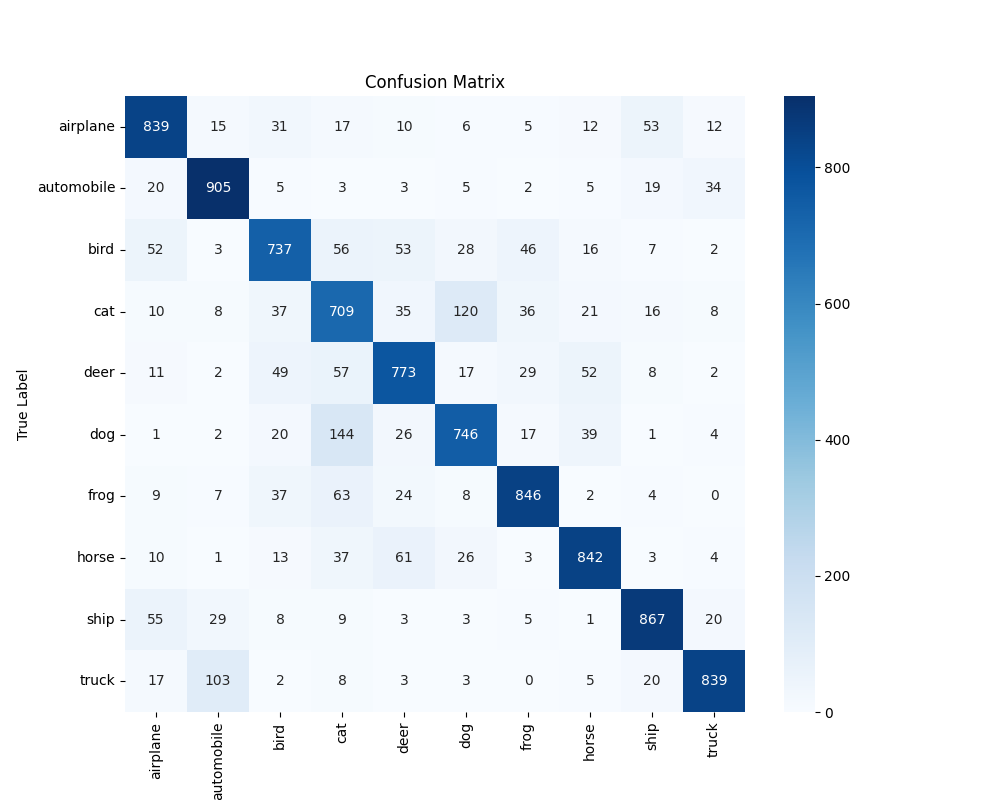
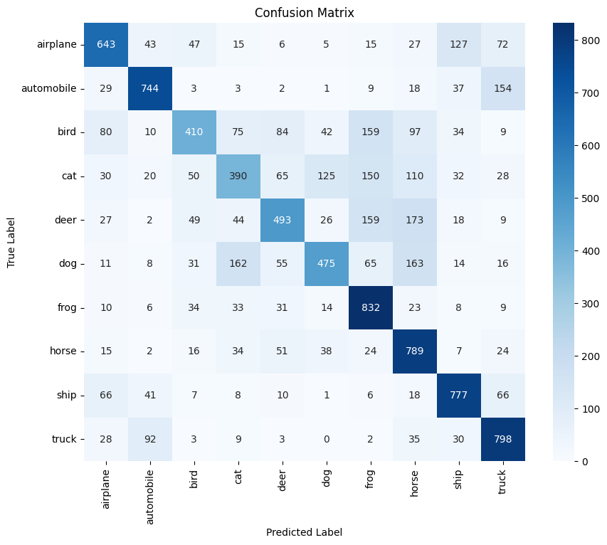

# Action Learning

## A Custom Lightweight Convolutional Neural Network Architecture for Edge-Based Inference using Arduino

------------

### Introduction

Over the past years, deep learning models have shown phenomenal success in various computer vision tasks. However,
deploying these models on edge devices remains difficult due to their algorithmic and memory stipulation. This project
aims to design and originate a custom lightweight Convolutional Neural Network (CNN) architecture specifically enhanced
for limited resource environments like Arduino-based TinyML kits. By targeted optimizations, the proposed model strives
for balanced accuracy with processing capability, enabling real time deduction on edge devices. The research includes
evaluating the custom structure against current lightweight models like MobileNetV3 and ShuffleNet, applying techniques
namely Quantization-Aware Training (QAT) and Post-Training Quantization (PTQ). The final goal is to implement the
optimized model on Arduino, making workable usability for active applications with nominal resource consumption, such as
inside a factory where multiple cameras are presented to classify objects.

----

### Installation

To run this project locally, please consult these instructions

1. Install Python 3.11, Postgresql 15.12

2. Clone the repository:
    ```bash
    git clone https://github.com/lam1910/social-media-preferences.git
    ```

3. For running the application
    ```bash
    cd app_demo
    ```

4. Install the required dependencies:
    ```bash
    pip install -r requirements.txt
    ```

5. Put your model at [models](app_demo/api/models) inside the api folder. Name it `mobilenet_transfer_v1_model.pth`

6. Change the secret in [.env.example](app_demo/api/.env.example) to your actual credential and remove the `.example`
   from the name

7. Run the creation DDL for the database inside your Postgresql instance
    ```bash
   psql -U <your_username> -d <your_database> -f api/db-action-learning.sql
    ```

8. For actual training models, it is best to upload the notebooks, found inside [notebooks](notebooks) folder, to cloud
   services like [Google Colab](https://colab.research.google.com/) to train. However, we can try using set it up on
   your own machine using
    ```bash
   cd notebooks
   pip install -r requirements.txt --index-url https://download.pytorch.org/whl/cu121
    ```

____

### Application Usage

1. Sign in
2. Put your prediction
3. Make a report if you think that the model was wrong
4. See your and the microprocessor past prediction
5. _(For admin privileged) Add more users to the system_
6. _(For admin privileged) Interactive overview of the system_

____

### Methodology

The methodology followed in this project includes:

1. Data Preprocessing: Cleaning and preparing the image for MobileNetV3 and/or Customized CNN model.
2. Applying Lighting Augmentation (if needed)
3. Classification: Put the processed image to the model for inference

_____

### Results

1. Confusion Matrix of the transfer learning MobileNetV3
   

2. Confusion Matrix of the Customed CNN model
   

_____

### Contributing

Contributions are welcome! If you have any suggestions or improvements, please fork the repository and submit a pull
request.
